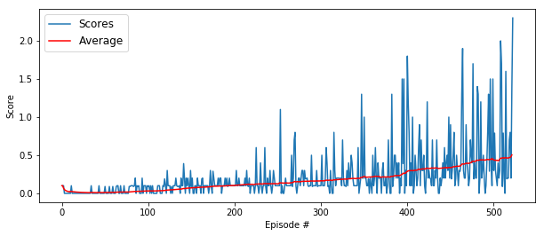
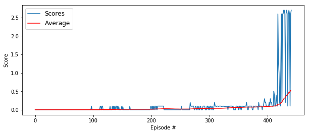

### Solution Walkthrough


#### The environment

The goal of this project is to train two RL agents to play tennis. As in real tennis, the goal of each player is to keep the ball in play. And, when you have two equally matched opponents, you tend to see fairly long exchanges where the players hit the ball back and forth over the net.


TThe observation space consists of 8 variables corresponding to the position and velocity of the ball and racket. Each agent receives its own, local observation. Two continuous actions are available, corresponding to movement toward (or away from) the net, and jumping.

The task is episodic, and in order to solve the environment, your agents must get an average score of +0.5 (over 100 consecutive episodes, after taking the maximum over both agents). Specifically,

* After each episode, we add up the rewards that each agent received (without discounting), to get a score for each agent. This yields 2 (potentially different) scores. We then take the maximum of these 2 scores.
* This yields a single score for each episode.


#### Solution components

##### Algorithm

The algorithm is used in this implementation is [Multi-Agent Deep Deterministic Policy Gradient MADDPG](https://arxiv.org/abs/1706.02275). MADDPG is based on DDPG agent that I used in the prevision Continuous Control project which provided a good starting point for prototyping and developing the final solution.


> _MADDPG decentralized actor with centralized critic [Lowe and Wu et al](https://arxiv.org/abs/1706.02275)._

The solutiion is based on decentralized actor with centralized critic architecture. It uses a single critic that receives as input the actions and state observations from all agents. This extra information makes training easier and allows for centralized training with decentralized execution i.e. each agents takes actions based on their own observations of the environment. 

##### Network architectues

[_Actor_](model.py) 
* First fully connected layer with input size 24 and output size 256
* Second fully connected layer with input size 256 and output size 128
* Third fully connected layer with input size 128 and output size 2


[_Critic_](model.py)
* First fully connected layer with input size 24 and output size 256
* Second fully connected layer with input size (256 + 2) = 258 and output size 128
* Third fully connected layer with input size 128 and output size 1
* Batch Normalization layer between first and second layers

I started with hidden layers sizes 512 and 384 for both actor and [384, 256] and ended up with [256, 128] model that converged reasonably well with with acceptable training time. I also tried using Batch Normalization for the actor network but it resulted in a worse traning performance.

##### OU Noise Function

To enable environment exploration especially at earlier 


#### Traning Results

##### Tranning results without noise decay

###### Agent traing logs

```
...
Episode 470, Average Score: 0.40, Max: 1.90, Min: 0.20, Avg: 0.62, Time: 3.82
Episode 480, Average Score: 0.42, Max: 1.70, Min: 0.10, Avg: 0.46, Time: 3.32
Episode 490, Average Score: 0.44, Max: 1.40, Min: 0.00, Avg: 0.53, Time: 0.48
Episode 500, Average Score: 0.44, Max: 1.50, Min: 0.10, Avg: 0.67, Time: 3.29
Episode 510, Average Score: 0.46, Max: 2.00, Min: 0.09, Avg: 0.61, Time: 0.57
Episode 520, Average Score: 0.47, Max: 1.60, Min: 0.00, Avg: 0.49, Time: 2.28


Environment solved in 522 episodes!	Moving Average Score: 0.504
```

###### Traning Graph




Test resluts without noise decay 
```
Total score (averaged over agents) this episode: 0.5450000083073974
Total score (averaged over agents) this episode: 0.1450000023469329
Total score (averaged over agents) this episode: 1.995000029914081
Total score (averaged over agents) this episode: 0.7950000129640102
Total score (averaged over agents) this episode: 0.8950000135228038
```

##### Tranning results with noise decay

###### Agent traing logs

 ```
 ...
Episode 370, Average Score: 0.07, Max: 0.20, Min: 0.00, Avg: 0.09, Time: 1.16
Episode 380, Average Score: 0.07, Max: 0.10, Min: 0.00, Avg: 0.08, Time: 0.90
Episode 390, Average Score: 0.08, Max: 0.20, Min: 0.00, Avg: 0.10, Time: 0.92
Episode 400, Average Score: 0.09, Max: 0.30, Min: 0.00, Avg: 0.14, Time: 0.93
Episode 410, Average Score: 0.10, Max: 0.30, Min: 0.10, Avg: 0.15, Time: 0.93
Episode 420, Average Score: 0.15, Max: 2.60, Min: 0.10, Avg: 0.67, Time: 11.83
Episode 430, Average Score: 0.32, Max: 2.70, Min: 0.10, Avg: 1.74, Time: 29.20
Episode 440, Average Score: 0.50, Max: 2.70, Min: 0.10, Avg: 1.88, Time: 29.27


Environment solved in 441 episodes!	Moving Average Score: 0.523
 ```
 
 ###### Traning Graph
 
 
 
 
 #### Testing Results

##### Aent testing logs without noise decay

```
Total score (averaged over agents) this episode: 0.9450000151991844
Total score (averaged over agents) this episode: 0.9450000142678618
Total score (averaged over agents) this episode: 0.24500000476837158
Total score (averaged over agents) this episode: 0.4950000075623393
Total score (averaged over agents) this episode: 0.3450000053271651
```

##### Agent testing logs with noise decay

```
Total score (averaged over agents) this episode: 2.600000038743019
Total score (averaged over agents) this episode: 0.04500000085681677
Total score (averaged over agents) this episode: 2.600000038743019
Total score (averaged over agents) this episode: 0.19500000309199095
Total score (averaged over agents) this episode: 2.600000038743019
```

 ### Exploration vs Exploitation
 
 As was mentioned before to OU Noise was introduced to enable environment exploration by the agent. There is a particular challenge related to this known as exploration vs. exploitation dilemma i.e. choosing which action to take while the agent is still learning the optimal policy. Should the agent choose an action based on the rewards observed so far. Alternatively should the agent explor other actions in hope and that will lead to pententially higher rewards later on? In this implementaion I investigated an impact of noise decay that reduces exploartion compoennt over time. I trained one model without noise decay and another one with ```_noise_decay = 0.999``` applied during model traing. 
 
The model without noise decay demostrated steady average score improment and was able to converge around 500 episode. I tried multiple traning rounds and there relatively small variation with the environment solved within 500-600 episodes. Introducing noise decay changed the training pattern. It took the agent longer to get average score improvent but but after some time the model converged very fast in just 20-30 episodes. Doing multiple trainng rounds showed singificant vartion in when the mode started to converge (between 400-700 episodes).
 
Model with noise decay had higer testing scores with bigger variation. The model without decay had lower testing scores with smaller variatioin. My interpretaton of the results is that without noise decay the agent spends more time exploring the environment and this leads to the model with broad action/state space that works reasonable well in most scenarios. With noise decay the agent spends less time exploring and this results in a model biased towards subset of action/state space. It performs really well in this subset and fares poorly with the environment states the agent hasn't explored enough.

 
